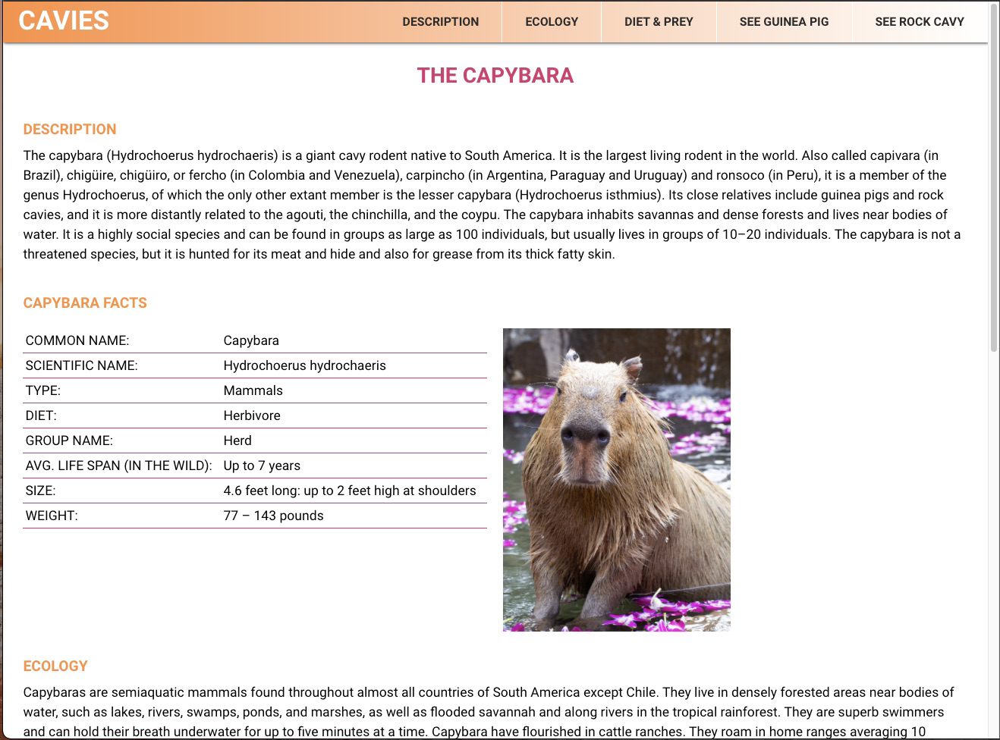
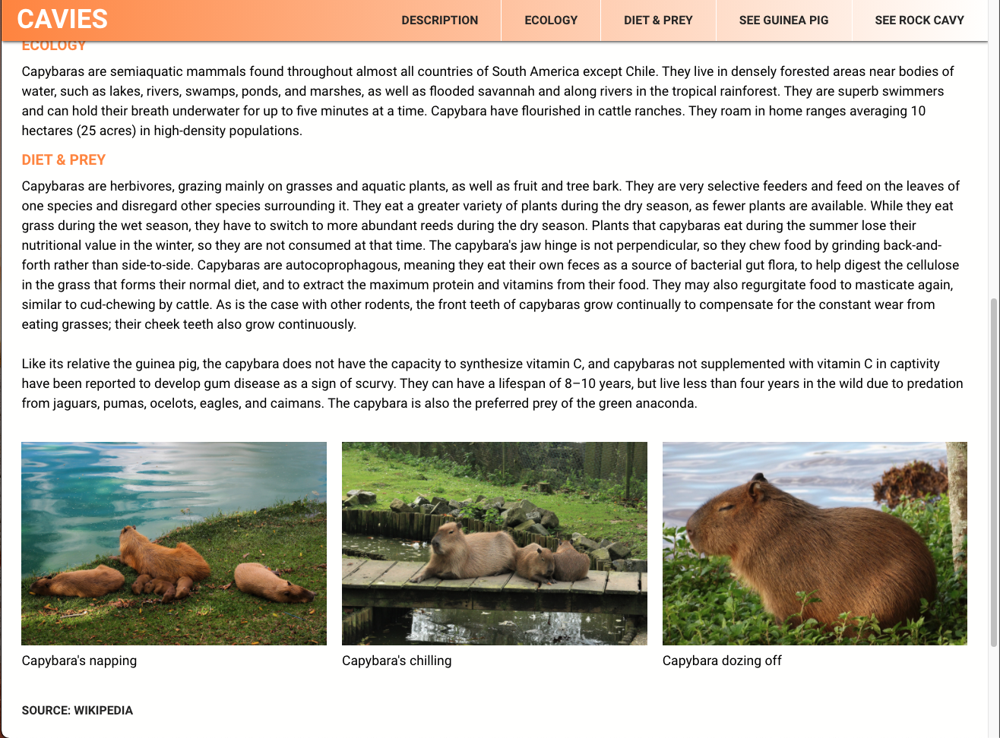
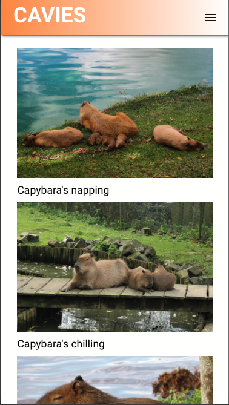
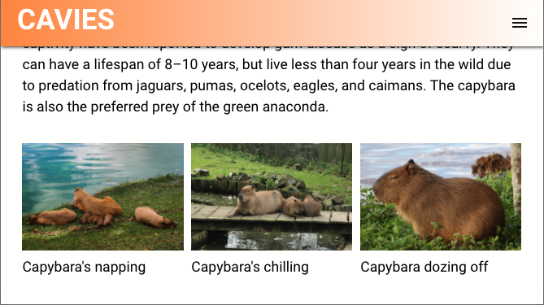

# Project - Cavies Website
**Author:**     Jessica Cassidy\
**Date:**      December 1, 2020
## Description: 
This was a final project for my Intermediate CSS and Preprocessor course at community college. 
The objective of the final was to create a mobile-first responsive website using CSS and LESS for styling. The goal was to pick 3 animals of 
our choice while utilzing Wikipedia information on those animals. 
## Website Preview:
**Desktop:**

**Mobile:**\

